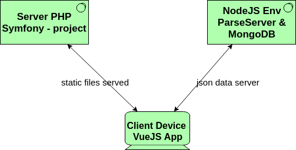

# Test for recruiting news Fullstack interns at ACESY TECH

## What this?

This is the subject of the test for recruitment of 2 news Fullstack Dev interns at ACESY TECH.

## What the aim of this test?

This test aims to test your proficiency at using the technology stack using at ACESY TECH in order to mark sure us that you will have a quick integration into our corporate projects. 

__*Note:*__ It just about ensuring that you have the minimum requirements.

## What is it about?

The test is simple, you have to build a Notepad application which allows every user to add and view their notes and only his. It should be a web application which follows this architecture above.

## Technology stack to be use in this project
* Symfony to serve static files of your application (html, css js - your vuejs app)
* VueJS to deal with all user interactions
  * vue-router (optional)
  * vuex (optional)
* Bootstrap to style your application
* NodeJS - ParseServer - MongoDB - For storing your users' information, and notes

## Advice on a path to follow
1. Fork this GitHub repository 
2. Clone it on your computer (It will contain all set of your project)
3. Start by creating a Symfony project within that folder
4. Integrate VueJS into Symfony
5. Create the notebook form
6. List notes created
7. Make the signup page
8. Make the login page
9. Deploy a ParseServer instance and store config files in parseserver folder within your project folder
10. Back in steps 7, and 8 to connect your user to ParseServer using their JS SDK
10. Back in steps 5, and 6 to scoped those actions to the logged users only
11. Style your application
12. Done! 

### Bonus 
* Shift your application in containers by adding required Docker files

## Additional instructions
* Commit your project at each step listed below
* Commits done after the expected deadline will not be consider
* Only the master branch will be check.
* Use your imagination for the UI/UX design but try not to exceed "3 pages"
  * one for the login
  * one for the signup
  * one for the adding note and listing added notes

## Send us your project
Write an email addressed to gabin.nguenda@acesy.net with the following subject `2018 Fullstack internship candidate - ${YOUR_NAME}`

In the content of your mail send us the link to the GitHub repository of this project and your CV.

## About ACESY TECH
__ACESY TECH__ is the lead SaaS provider in Africa. We building software to leverage companies' acquisition, deployment, and usage of software to run their business

*__Good luck!!__* see you at ACESY TECH